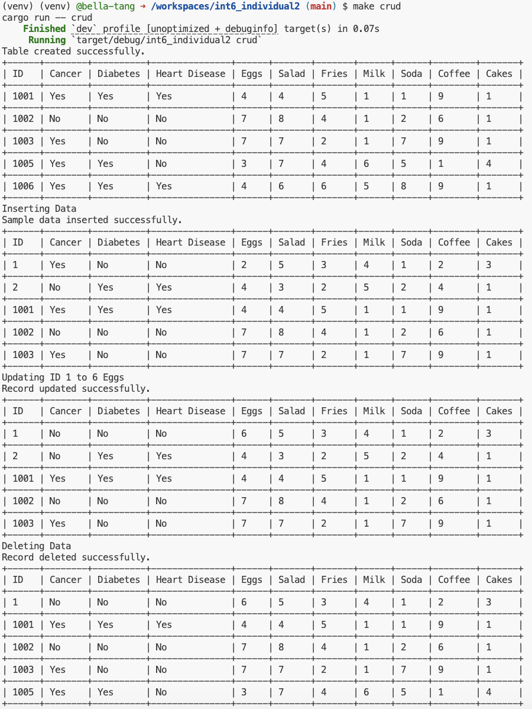
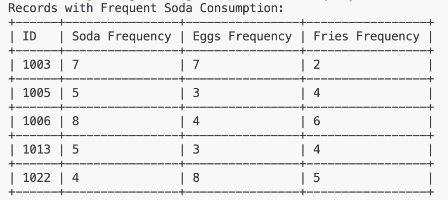
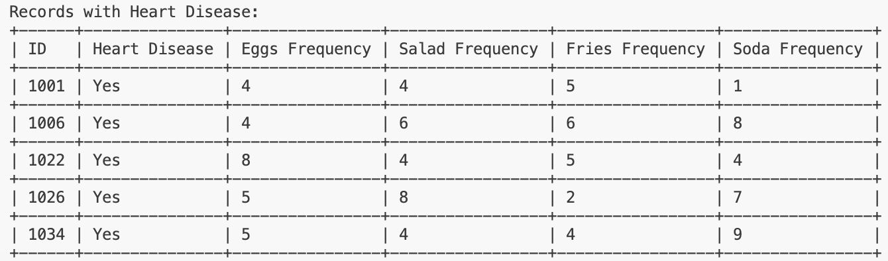
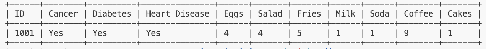
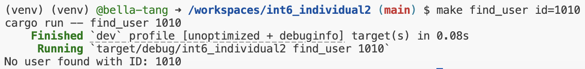
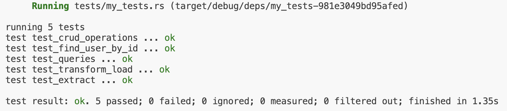

## int6_individual2
[](https://github.com/nogibjj/int6_miniproject5/actions/workflows/cicd.yml)
### File Structure
```
int6_individual2
├── .devcontainer/
│   ├── devcontainer.json
│   └── Dockerfile
├── .github/
│   └── workflows/ci.yml
├── .gitignore
├── Cargo.lock
├── Cargo.toml
├── src
│   ├── lib.rs
│   └── main.rs
├── LICENSE
├── Makefile
├── Nutrition.db
├── README.md
├── data
│   └── Nutrition.csv
|   └── Nutrition_subset.csv
├── requirements.txt
├── setup.sh
└── tests
    └── my_tests.rs
```

This repo contains work for individual project 2. It sets up an environment on codespaces and uses Github Actions to run a Makefile for the following: `make install`, `make test`, `make format`, and `make lint`. This project also has additional actions for `make extract`, `make transform_load`, `make_crud`, `make query`, and `make find_user`.

Some important components:

* `Makefile`

* `Dockerfile`

* A base set of libraries for devops and web

* `githubactions` 

## Purpose of project
The purpose of this project is to create a basic ETL pipeline with CRUD operations and SQL queries in Rust. It includes a CLI interface and a process to generate an optimized Rust binary. The dataset was sourced from the [fivethirtyeight github](https://github.com/fivethirtyeight/data/blob/master/nutrition-studies/raw_anonymized_data.csv) and details individuals' health and nutrition information. For ease of use, we connect to an SQLite database.

## Dependencies
Project dependencies can be found in Cargo.toml. Notable dependencies include **rusqlite** for connecting to SQLite database, **csv** for extracting and loading data as a csv format, and **prettytable-rs** for better formatting of outputs.

## Preparation
1. Open codespaces 
2. Wait for container to be built and virtual environment to be activated

### Rust Preparation and Installation
#### Option 1: Download Prerequisites
* (Open Codespaces)
* Install **Rust** and **Cargo** locally
  * You can install Rust using `rustup` if you haven't already:
  ```bash
  curl --proto '=https' --tlsv1.2 -sSf https://sh.rustup.rs | sh
* Run `cargo build` to build dependencies
#### Option 2: Using Prebuilt Binary Artifact
* Alternatively, you can download the prebuilt binary artifact from the latest CI/CD workflow run in the Actions tab of the GitHub repository.
  1. Go to the **Actions** tab in the repository.
  2. Select the latest successful workflow run.
  3. Scroll down to the **Artifacts** section.
  4. Download the binary named `rust-binary-artifact`.
  5. Upload the binary to your environment (i.e. Codespaces or your Linux machine)
### Load Data
* Run `make extract`
* Run `make transform_load`

## Important Functions in lib.rs
* `extract()`, `transform_load()`: ETL functions to extract, transform, and load data from github URL and load into a SQLite database
* `create_table()`, `insert_data()`, `read_data()`, `update_data()`, `delete_data()`: demonstrates working CRUD operations
* `run_crud_operations()`: compiles all crud operations
* `query_frequent_soda()`: returns individuals with soda frequency over 3
* `query_heart_disease()`: returns eating habits of individuals with heart disease
* `find_user_by_id()`: returns record for specified user id

These functions are tested in tests/my_tests.rs. To make sure github actions is working properly, I use a Makefile to test various parts of my code.

## Successful CRUD Operations
  

## Available Pre-Written Queries
* Run `make query` to run `query_frequent_soda()` and `query_heart_disease()`
  * `query_frequent_soda()` returns individuals with soda frequency above 3   
  
  * `query_heart_disease()` returns individuals with heart disease   
  

## CLI Component
* Run `make find_user id={user_specified_id}` to run the `find_user_by_id` function. This returns a single record for the specified user_id, or notifies the user about invalid id if no matching records are found.
#### Example Usage:
* `make find_user id=1001`   
  
* `make find_user id=1010`   
  


## Check format and test errors 
1. Format code `make format`
2. Lint code `make lint`
3. Test code `make test`   


## Use of LLM
I used GitHub copilot to transform my previous Python ETL functions into Rust. While using an LLM to generate code helped make the process more efficient, I realized that it was important to be very specific when prompting the LLM. In order for the suggested code to integrate with my existing project, I had to perform additional checks to make sure all relevant dependencies were included and filenames were consistent. GitHub copilot was successful in producing template code for my Rust ETL implementation and allowed me to focus on refining the more logical components of this project rather than spending time on syntax. 

## References 
template from: https://github.com/nogibjj/int6_miniproject5   
forked from: https://github.com/nogibjj/sqlite-lab